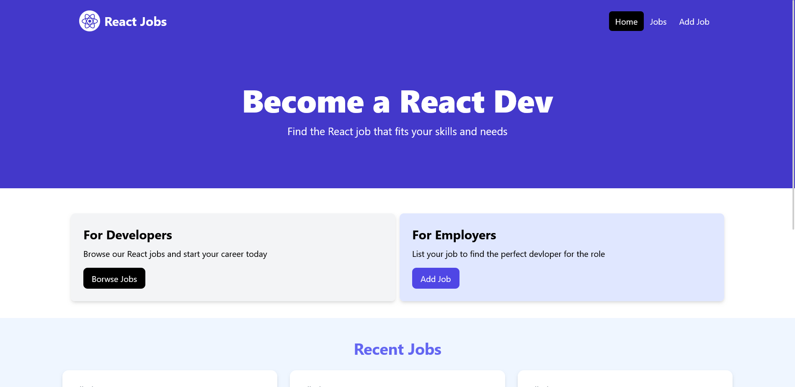
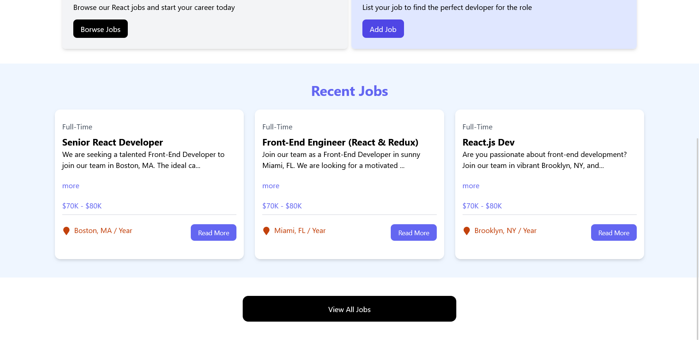
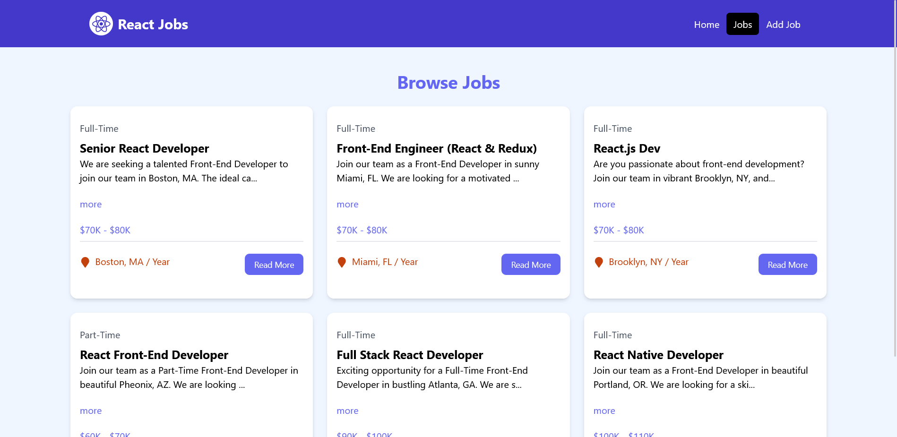
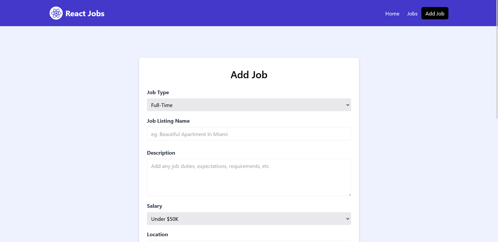

# React Jobs

This React project allows you to manage a list of jobs. 

## Screenshots

    
    
    
    

## It offers the following functionalities:

- View the list of existing jobs
- Add a new job
- Delete an existing job
- Modify the information of a job

## Technologies used
- React
- Tailwind CSS
- useState (local state management)
- useLoaderData (loading initial data)
- useParams (accessing URL parameters)
- useNavigate (navigation between routes)
- Link (creating internal links)
- react-toastify (notifications)
- react-icons (icons)
- react-spinners (loading)
- json-server

